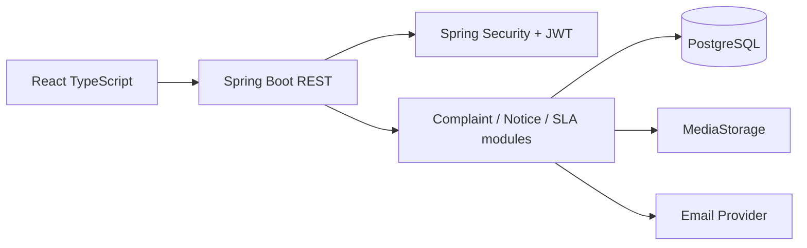

# Architecture

The system is a modular monolith. Domain modules remain separated by package boundaries while sharing one deployment and database. This is intentionally simpler than microservices for a society-scale workload.

## Request flow
Browser → JWT filter → controller → service/domain validation → repository → PostgreSQL. Controllers only translate HTTP concerns; lifecycle rules live in services.

## Complaint lifecycle
OPEN → IN_PROGRESS → RESOLVED. Every transition creates an immutable history record with actor, timestamp and note.

## SLA
`due_at` is calculated from category SLA hours and priority. Overdue state is derived from `due_at` and current status rather than stored as mutable state.

## Notifications
State changes commit independently of email delivery. Email work runs asynchronously and failures are logged.

## Media
PostgreSQL stores metadata; the storage abstraction writes binaries to local disk in development and can be backed by S3-compatible storage in production.
